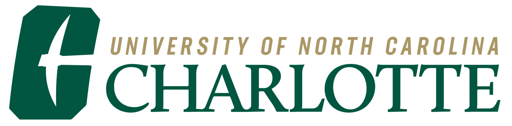

# Hey, I'm Nate! 👋

	 &emsp; &emsp;
	 &emsp; &emsp;
	 &emsp; &emsp;
	 &emsp; &emsp;
	

I am a Doctoral Candidate at the University of North Carolina at Charlotte studying Environmental Policy.

⭐ I am also interested in data analytics, machine learning, and telling stories through data visualisation.

💼 I am seeking Data Science/Analytics and Survey Research related full-time roles and am open to relocate.

### 📫 Reach me at 

[ LinkedIn](https://www.linkedin.com/in/nathanduma/)
